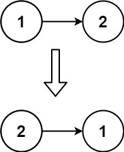

# Reverse Linked list

Given the `head` of a singly linked list, reverse the list, and return the reversed list.

**Example 1:**  

> Input: head = [1,2,3,4,5]  
> Output: [5,4,3,2,1]

**Example 2:**  

> Input: head = [1,2]  
> Output: [2,1]

**Example 3:**

> Input: head = []  
> Output: []

**Constraints:**

- The number of nodes in the list is the range `[0, 5000]`.
- `-5000 <= Node.val <= 5000`

**Follow up:** A linked list can be reversed either iteratively or recursively. Could you implement both?

## Brainstorming

- Since the next of the first node points to the second value, the next of the second value needs to point to the first value
- For that, a checker needs to be in place, which checks if the value of the next node is present or not, or simply, if the current node points to a next node or not
