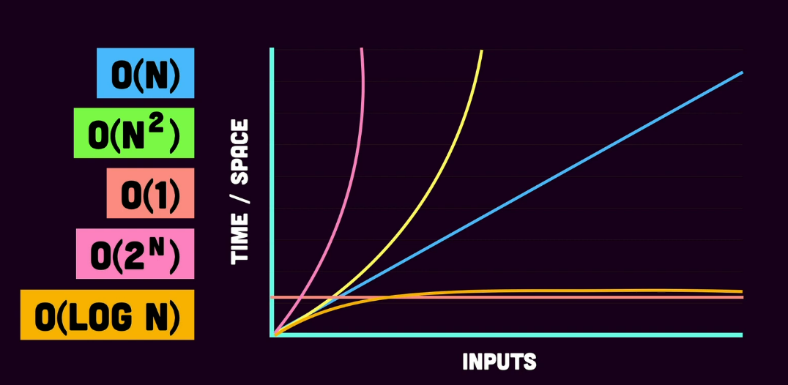

# Time Complexity

- In simple words, it is the number of steps taken to complete the program
- It is a way to measure the time taken for the program's execution
- it is measured by the unit of Big-O, where `O(1) < O(log n) < O(n) < O(n^2) < O(2^n)`, where all these are merely the different time complexities that a program can have

> For eg: A nested loop has `O(n^2)` complexity, cz every iteration of `i`, `j` iterates till n. In a simple looping of an array, time complexity is O(n), where n is the num of items in the array

- Reference graph for how time complexities stack up
  

- Reference [yt video](https://www.youtube.com/watch?v=Z0bH0cMY0E8) for better understanding
